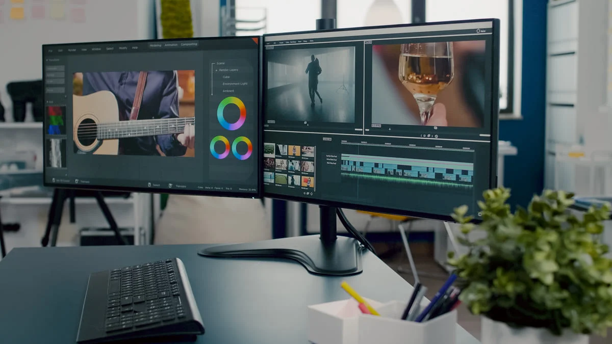

# MITO:  ¿MUCHAS HORAS AL DÍA DE PANTALLAS AFECTA A TU VISTA?

Actualmente **no existen evidencias científicas** del daño en nuestra vista que podría tener este hábito y, aunque las pantallas no son malas en sí mismas para el ojo, sí que pueden generar ciertas molestias. Cuando pasamos muchas horas leyendo en el teléfono móvil o en el ordenador, **tendemos a parpadear con menos frecuencia que cuando realizamos otro tipo de tarea.** Esto provoca que la lubricación del ojo sea menor, lo que tendría relación con ciertas patologías de superficie ocular como es el caso del ojo seco y sus síntomas: visión borrosa, sensación de arenilla en el ojo, escozor y enrojecimiento. 

---
En resumen, podemos usar las pantallas sin miedo, que ***no está comprobado*** que hagan daño

[Web2](2.md)